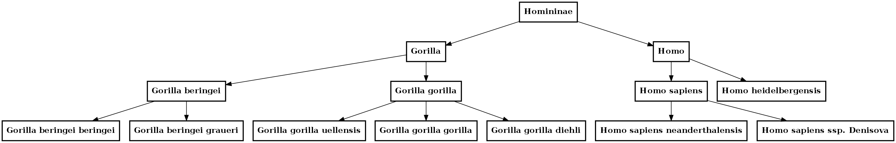

Taxonomy - the science of classifying organisms
====================================================

Organisms have common and scientific name but all organisms have only 1 scientific name (usually Latin or Greek) 
developed by Carolus Linnaeus. Scientific names follow a specific set of rules and a two-name system called a  **Binomial Nomenclature**. The first word 
indicates the *Genus*  and the second word indicates the *species*. The first word is capitalized and the second is not. For example *Homo sapiens*.

The taxonomy way of classifying organism is based on similarities between different organisms.
Linneaus also createdd a system to organize animals using large groups divided in subgroups. These subgroups are ::

    Kingdom -  Phylum - Class - Order - Family - Genus - Species
    
For instance, for *Homo sapiens* we have these names for each group::

    Animalia - Chordata - Mammalia - Primate - Homindae -  Homo - sapiens
 

    
Kingdom
---------
There are currently 6 kingdoms. Organisms are placed into their kingdoms based on hte number and type of 
cells they have (and nutritional needs).

The kingdoms are archaebacteria, eubacteria, fungae, plantae, animalia, protista.

Cladogram
----------

Kind of Venn diagram showing relations between organism.

Identifier
------------

Organism Mnemonic
-----------------
In the uniprot taxonomy database, to simplify manipulation of organism, a mnemonic identification code is used. It is made of 5 alphanumeric characters. 

It is made in general of the 3 first letter sof the genux name and two first letters of the species name.
Example: NAJNI for *Naja nivea*. 16 Commom organisms have their own code::

    BOVIN for Bovine
    CHICK for Chicken
    ECOLI for Escherichia coli
    HORSE for Horse
    HUMAN for Homo sapiens
    MAIZE for Maize (Zea mays)
    MOUSE for Mouse
    PEA for Garden pea (Pisum sativum)
    PIG for Pig
    RABIT for Rabbit
    RAT for Rat
    SHEEP for Sheep
    SOYBN for Soybean (Glycine max)
    TOBAC for Common tobacco (Nicotina tabacum)
    WHEAT for Wheat (Triticum aestivum)
    YEAST for Baker’s yeast (Saccharomyces cerevisiae)

Lineage and taxonomy node rank
---------------------------------

Organisms are organised in a tree structure that represents the taxonomic lineage. Each organism represents a node, which position on the tree is determined by its rank in the taxonomy hierarchy. 
Note that the last ranks (usually species or subspecies) represent the leaves on the tree’s branches.
On the other side,  higher ranks (e.g. phylum, order and family) are placed higher on the tree. The ordered list of the nodes forms the lineage.

::

    from biokit import Taxonomy
    t = Taxonomy() 
    t.load_records()

    # 207598 is Homininae

    ret = t.get_family_tree(207598)
    
    # This is not using biokit anymore but a tool to look at graph.
    # We could use networkx
    from cno import CNOGraph
    for x in ret:
        if int(x[0]) in t.records.keys() and int(x[1]) in t.records.keys():
            e1 = t.records[int(x[0])]['scientific_name'];
            e2 = t.records[int(x[1])]['scientific_name'];
            if 'Pan' not in e1 and 'Pan' not in e2:
                c.add_edge(e1, e2, link='+')

    c.plot()

Count taxon by rank:
--------------------------

::

    from biokit import Taxonomy
     t = Taxonomy()
    t.load_records()
    
    ranks = [t.records[x]['rank'] for x in t.records.keys()]
    names = [t.records[x]['scientific_name'] for x in t.records.keys()]
    ids = [t.records[x]['id'] for x in t.records.keys()]
    parents = [t.records[x]['parent'] for x in t.records.keys()]

    # you can convert data to a data frame and group by rank !
    import pandas as pd
    df = pd.DataFrame({'rank':ranks, 'id':ids, 'name':names, 'parent':parents})
    groups = df.groupby('rank')
    groups.count().sort('id')

::

                       id     name
    rank                              
    subkingdom              1        1
    kingdom                 3        3
    superphylum             5        5
    superkingdom            5        5
    superclass              5        5
    parvorder               6        6
    infraclass             16       16
    subphylum              25       25
    superorder             49       49
    infraorder             90       90
    species subgroup      125      125
    subclass              129      129
    phylum                132      132
    class                 291      291
    suborder              314      314
    species group         331      331
    forma                 425      425
    subtribe              451      451
    superfamily           798      798
    subgenus             1182     1182
    order                1336     1336
    tribe                1822     1822
    subfamily            2559     2559
    varietas             6144     6144
    family               8103     8103
    subspecies          18572    18572
    genus               75367    75367
    no rank            182917   182917
    species           1047411  1047411

